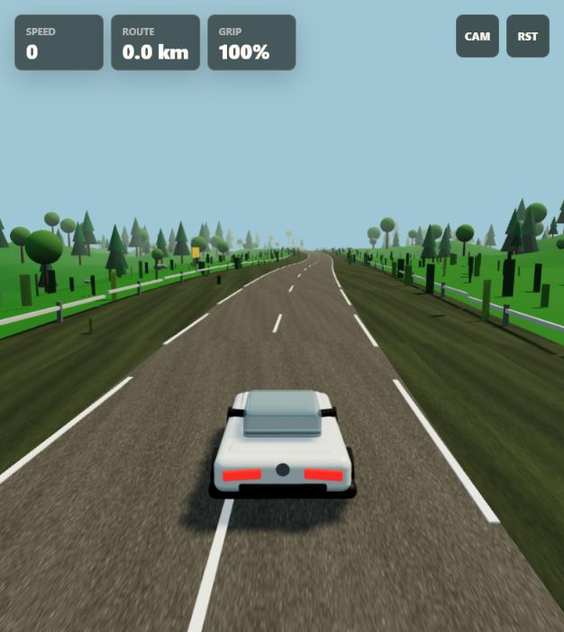
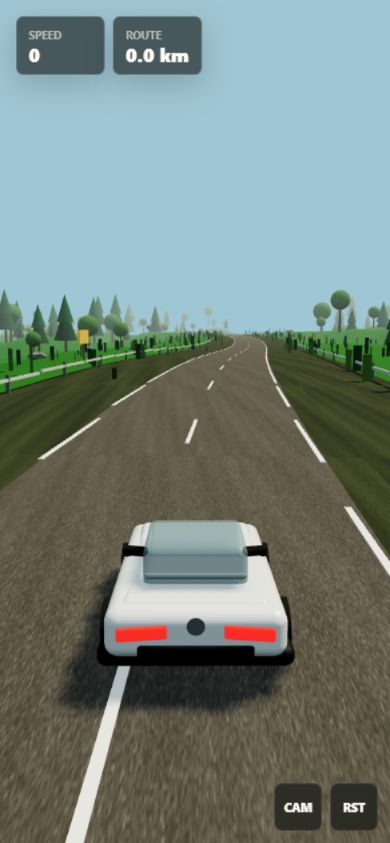

# Rough Road v1

A browser-based procedural driving prototype built with Vite, TypeScript, and Three.js. Rough Road v1 is inspired by calm open-road driving sims, but the implementation here is original: procedural terrain, a generated road mesh, local vehicle dynamics, and code-native scenery assets.



## Current MVP

- Procedural curved highway with elevation changes, asphalt texture, shoulders, lane markings, guard rails, and roadside signs.
- Glossy white coupe model built from live Three.js geometry with glass, lamps, mirrors, rims, bumper detail, and visible steering wheel yaw.
- Dense roadside greenery with mixed conifers, broadleaf trees, darker forest bands, rocks, and grass clumps.
- Lightweight vehicle dynamics with acceleration, braking, reversing, grip loss, off-road drag, steering assist, and dust.
- Three camera modes, reset control, speed/distance/grip HUD, desktop and mobile responsive layout.



## Controls

| Input | Action |
| --- | --- |
| `W` or Up arrow | Accelerate |
| `S` or Down arrow | Brake / reverse |
| `A` or Left arrow | Steer left |
| `D` or Right arrow | Steer right |
| `Space` | Handbrake |
| `CAM` | Cycle camera |
| `RST` | Reset vehicle |

## Run Locally

Use `npm.cmd` on Windows PowerShell if `npm.ps1` is blocked by execution policy.

```powershell
npm.cmd install
npm.cmd run dev -- --host 127.0.0.1 --port 5173
```

Open:

```text
http://127.0.0.1:5173/
```

Production build:

```powershell
npm.cmd run build
```

## Smoke Test Notes

The app exposes a deterministic local-only steering smoke route:

```text
http://127.0.0.1:5173/?smoke=steering
```

That route steps the car with synthetic left and right steering, then writes pass/fail state into DOM `data-*` attributes. It is used to verify that:

- left and right steering inputs are opposite;
- front-wheel yaw follows the corrected visual direction;
- right steering moves the vehicle screen-right relative to left steering in the chase camera;
- throttle produces motion.

The route is passive and does not affect normal gameplay.

## Tech Stack

- Vite for local development and production bundling.
- TypeScript for strict runtime logic and editor safety.
- Three.js/WebGL for the 3D renderer, scene graph, lighting, shadows, procedural meshes, and instanced scenery.

## Project Shape

```text
src/
  game/
    CameraRig.ts
    DustTrail.ts
    InputController.ts
    RoadModel.ts
    RoadSurface.ts
    RoughRoadGame.ts
    Scenery.ts
    TerrainSurface.ts
    Vehicle.ts
    math.ts
    textures.ts
```

Generated outputs such as `dist/`, `node_modules/`, and log files are ignored by Git.
